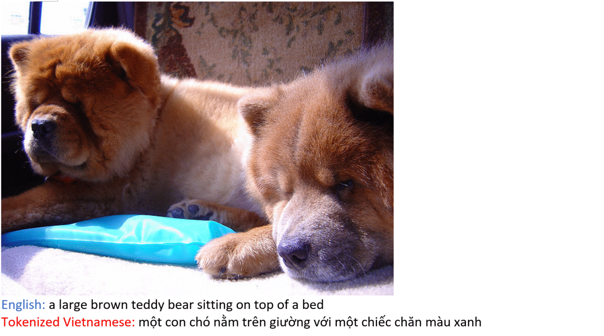

# Image Captioning in Vietnamese
Re-Implementation of the CNN+LSTM model for Image Captioning in Vietnamese.

Original source code: [here](https://github.com/tensorflow/models/tree/master/research/im2txt)




## Vietnamese Image-Caption Dataset (COCO4K_VN)
Published here:

https://drive.google.com/drive/folders/1uWgMETh2TjD9skVLEoJ6XwoDnJMvcP_9

Contains:
* 4000 Train images
* 138 Test images
* Folder Captions_JSON_format: captions for above images (5 captions/image), in MSCOCO JSON [format](http://cocodataset.org/#format-data). 
* Pretrained Models: models trained in 4000 images.

The suffix in filename indicates the different of caption languages: \_en (English), \_vn (Human Translation), \_googlevn (Google Translation), \_tk (Applied Tokenization)

Source code of the tool using for Human Translation:
https://github.com/Flavius1996/VNcap_Translator

## FIRST: Install Required Packages
Installed the following required packages:
* **Bazel** ([instructions](https://docs.bazel.build/versions/master/install-ubuntu.html))
* **TensorFlow** ([instructions](https://www.tensorflow.org/install/))
* **NumPy** ([instructions](http://www.scipy.org/install.html))
* **Natural Language Toolkit (NLTK)**:
    * First install NLTK ([instructions](http://www.nltk.org/install.html))
    * Then install the NLTK data package "punkt" ([instructions](http://www.nltk.org/data.html))
* **Unzip**

## TESTING:
### Download a pretrained models and word_count file.
Choose a model in [pretrained COCO4K_VN models](https://drive.google.com/drive/u/1/folders/1_cal7Dekx5n9ovkOxwk_AXZbWevqTfjk).

For example, we choose [the model](https://drive.google.com/drive/u/1/folders/1tnIwdofIzZjtgfrtTTA8ob5qOG-TWHr7) which trained on 4000 images with Tokenized Human_Translation Vietnamese captions. A tensorflow model is packed in 3 file: .cpkt-<iter>-data-00000-of-00001, .cpkt-index and .cpkt-meta, you need download all 3 files to the same folder. 

Note: Some pretrained model folders in COCO4K_VN will have 2 models respectively from 2 phases of training process. You only need to choose 1 model to download. The number in filename indicates the training iteration. 
  
It is also required a vocabulary file to run testing. You can find this file in each folder of pretrained models, name: word_count.txt
  
### Test only 1 image
Edit following lines in test.sh:
```shell
CHECKPOINT_PATH=<Path to the folder which contains 3 files of pretrained model>
VOCAB_FILE=<Path to word_count.txt file>
IMAGE_FILE=<Path to an image>
RESULT_JSONFILE=""    # Must set to empty string for running only 1 image
```
**Run test.sh**

Note: the generated caption will be printed to the terminal (command-line) window, some unicode charaters may be printed as square boxes. 

### Test whole 138-image folder
Edit following lines in test.sh:
```shell
CHECKPOINT_PATH=<Path to the folder which contains 3 files of pretrained model>
VOCAB_FILE=<Path to word_count.txt file>
IMAGE_FILE=<the pattern of images in folder, ex: "${HOME}/im2txt/Images_test/*.jpg">
RESULT_JSONFILE=<Name of the output result json file>
```
**Run test.sh**

The RESULT_JSONFILE is needed if you want to perform Evaluation code for BLEU, ROUGE, CIDEr.

## TRAINING:
### Download 4000 train images and captions
You can download the 4000 images [here](https://drive.google.com/open?id=1OLNtHYqgAKITlzeWd1U1aCeTEIggR7ly)

Choose the language of captions you want to train at folder Captions_JSON_format in [COCO4K_VN](https://drive.google.com/drive/folders/1uWgMETh2TjD9skVLEoJ6XwoDnJMvcP_9). For example, here we choose [Vietnamese captions](https://drive.google.com/open?id=1cZJkkk2dUFoVoKorA8g0rNBxXuj91z3l) which translated by Human and applied Tokenization.

Download Pre-trained Inception-v3 on ImageNet dataset: **Run down_inceptionv3.sh**

### Prepare dataset
Edit ./im2txt/data/preprocess_VNcap.sh:
```shell
TRAIN_IMAGE_DIR=<the downloaded folder of 4000 images>
TRAIN_CAPTIONS_FILE="the json file contains 20000 captions"
```
Edit ./im2txt/configuration.py:
```shell
    self.values_per_input_shard = 1300      # This number must larger than #captions/#train_shards in ./im2txt/data/build_VNcap_data.py, 20000/16 = 1250, so we choose 1300 for safety
    self.batch_size = 32                    # adjust this number to fit your GPU's memory
    self.num_examples_per_epoch = 20000     # equal to number of caption
```
Edit prepare_dataset.sh:
```shell
MSCOCO_DIR=<Where you want to save the prepared dataset>
```
**Run prepare_dataset.sh**

After this, you will have 16 TFRecord files, which contain 20000 image-caption pairs, and a vocabulary file (word_counts.txt) at <MSCOCO_DIR> folder. The implement uses TFRecord files for faster training and mode efficient on data allocation, but the storage is 5-time larger than normal.

### Training Phase 1: fit LSTM weights
At this phase, we are only training the weights of LSTM, Image Embedding layer, and Word Embedding layer.

Edit train.sh:
```shell
MSCOCO_DIR=<Path to prepared dataset>
INCEPTION_CHECKPOINT=<Path to pretrained Inception-v3>
MODEL_DIR=<Where to save the model>

...

  --train_inception=false \
  --number_of_steps=100000
```
**Run train.sh**

### Training Phase 2: finetune Inception-v3 and LSTM weights
Phase 2, we also fine-tune Inception-v3. This phase will require a lot of GPU memory, so remember to reduce the batch_size at ./im2txt/configuration.py if you encounter the Out-Of-Memory (OOM) error.

Edit train.sh:
```shell
MSCOCO_DIR=<Path to prepared dataset>
INCEPTION_CHECKPOINT=<Path to pretrained Inception-v3>
MODEL_DIR=<Where to save the model>

...

  --train_inception=true \
  --number_of_steps=200000
```
**Run train.sh**

Normally, the whole training process takes 3-4 days on a single Tesla K20 (5 GB).

## REFERENCE:
O. Vinyals, A. Toshev, S. Bengio, and D. Erhan, “Show and tell: A neural image caption generator,” in Proceedings of the IEEE Computer Society Conference on Computer Vision and Pattern Recognition, 2015.
